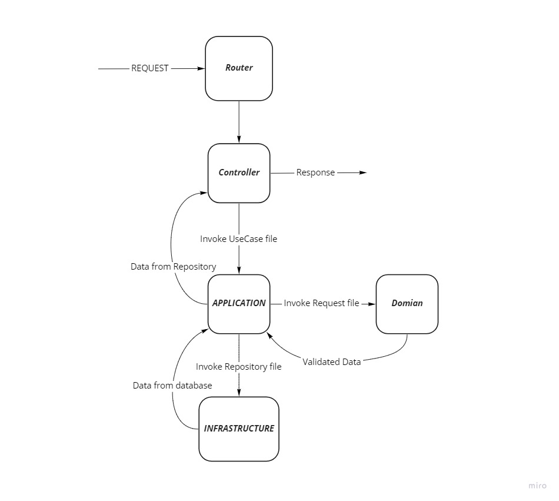

# Uniplato-assignment

## How to run the application

1. Create a .env file in the root directory of the project and copy everything inside the .env.example file into it.

2. Run this command in root directory of the project in order to build images and run the containers. It may take a while depends on your internet download speed.

   ```bash
   docker-compose up --build
   ```

   If you build the images before, just run this command

   ```bash
   docker-compose up
   ```

   When you see this message `server is Listening on port 3000`, server is ready.

3. Server needs data to work , so run this command to run the data base seeder.

   ```bash
    docker exec -it app-mysql bash /mysql/seed.sh
   ```

   If you see this error

   ` Can't connect to local MySQL server through socket`

   try again after a while. remember that mysql server needs time to be ready for accepting connections.

## Application structure

I use DDD structure for this project. In this structure there is 4 part.

1. **Interface** \
   Interface is the web server part of the structure. In this section we put our web server ( express in this project ). \
   Server.ts file is responsible for running web server and router.ts is the master router (app in express) handles the module router such as category router. Endpoints Are written inside the module routers.

2. **Domain** \
   Domain is responsible for the validations. Every request must validate in the request files inside the domain.

3. **Infrastructure** \
   Infrastructure is for the data base connections and other services that have connections to the outside of the app. Also we put the third party services like translator and logger in this section. database repositories and models should place in this section.

4. **Application** \
   Application is where the logic of the app is formed. In the Application
   files that have the **_UseCase_** keyword in the end of their names, Domain and Infrastructure functions are invoked.

## Application workflow



## Running test

Use this command to run the unit tests.

```bash
docker exec -it app-category npm run test:unit
```

If anything goes wrong while running the tests, please stop the containers and delete node_module file and start the app again(npm error).

## Dependencies

1. **AJV**: Validator
2. **Awilix**: Dependency injector
3. **Express**: Web server
4. **Prisma**: Database ORM
5. **Jest** : Test
